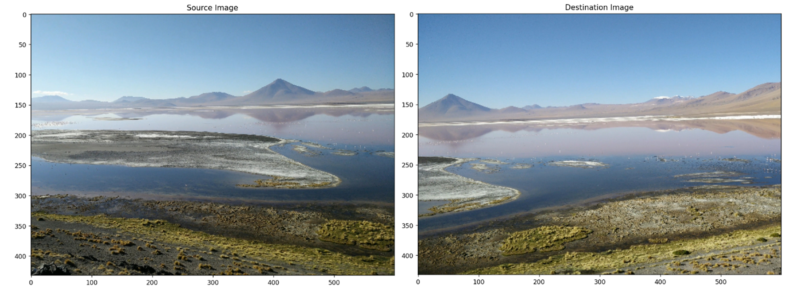
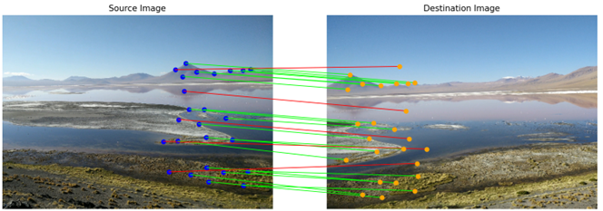
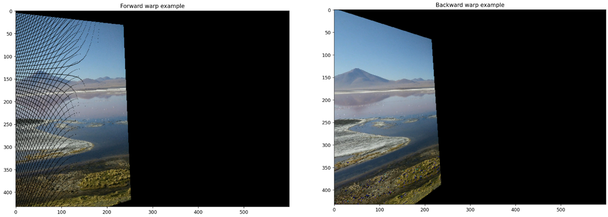
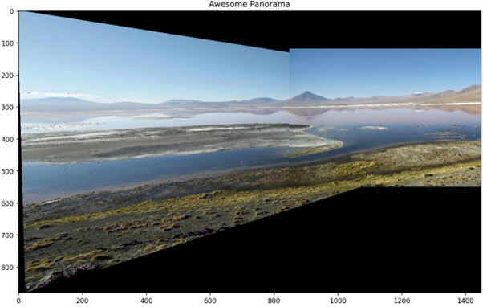
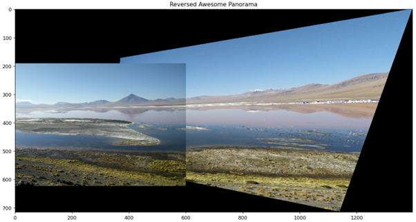

  <h1 align="center">Panorama</h1>

## Introduction

We have 3D scene, and we take a set of images of the scene from the same viewpoint, but by rotating the camera. The fields of view of the images that we capture overlaps. We want to take the set of the images and automatically to create a larger image. We want to stitch them together to create a panorama image.

## Stages

* Take 2 images of the same view with a small rotation between them.
* Find matching points between the images.
* Compute Homography using RANSAC algorithm (may be outliers).
* Create Panorama coordinates system – define a bounding box.
* Copy first image to the bounding box.
* Compute Backward mapping from Panorama to the second image. If computing out of the images’ pixel, need to set black pixel instead. 

## Raw Images

I extracted 2 images out of a video I took a few years ago at the Bolivia desert.

  

## Imperfect Matching points (20/25)

  

## Forward and Backward mapping

  

There are 2 issues with the forward mapping method:
* When I used this method, I went through each pixel in the image and computed the forward mapping and got pixels that may not be centered in the new image. I solved it by flooring the values of the locations of the pixels.
* The second issue that more major is when I filled the transformed image, I ended up with pixels that didn't fill and shown as holes in the image.

## Panorama Image

  

## Reversed Panorama Image

  

## Conclusions

* I got decent results with the panorama images.
* The view of the reversed panorama image looks more natural, compared to the first panorama image that looks too much stretched on the left side.
* The mountains in the first panorama image doesn’t align perfectly.
* There are violated pixels in the images – shown as green, red, or blue instead of the real color of the image.
* Can clearly see the seam (stitch) between the images, and it doesn’t look like one big picture. This is caused by the differences in exposure, brightness, and colors that the camera captured between the 2 frames.

## Next Steps

* I can fix the violated pixels.
* I can fix the seam by applying blending methods like weighted filters on the images before stitching them.
